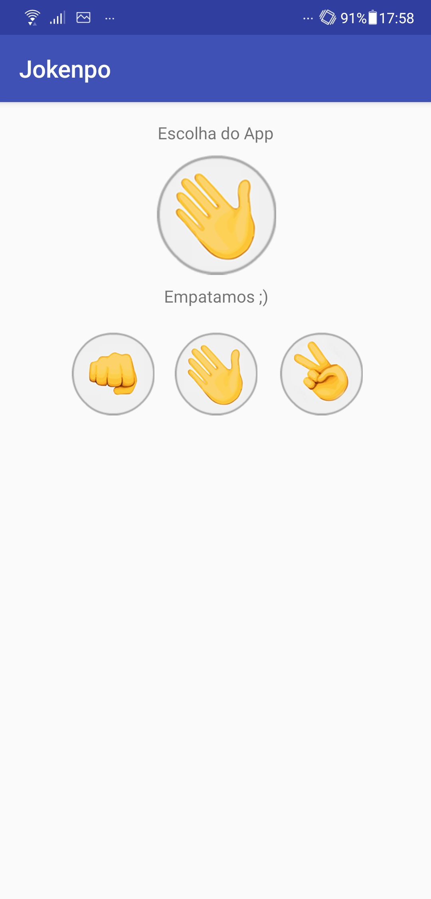

    <h1> Jokenpo App </h1>

 

<h2> 💡 Descrição </h2>
Aplicativo de Jokenpo tradicional, um jogo em que as pessoas jogam com as mãos, escolhendo entre pedra, papel e tesoura, agora recriado para a tela de celulares.
Sabemos que papel vence pedra, pedra vence tesoura e tesoura vence papel. Por tradição, não há como saber qual tipo o oponente revelará.
Vamos relembrar os velhos tempos de criança!

 

| | | | |
|:-------------------------:|:-------------------------:|:-------------------------:|:-------------------------:|
| | || |
 

